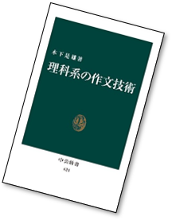
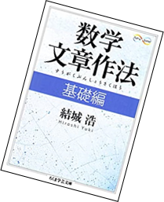
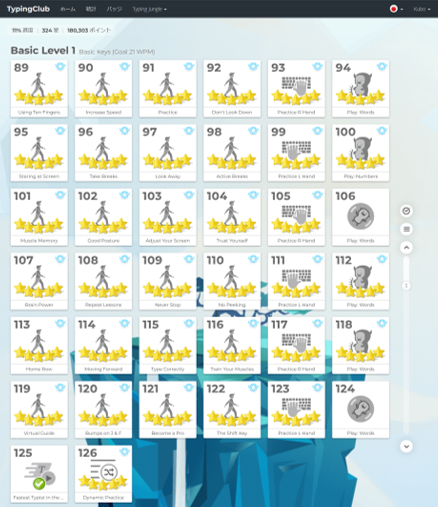

# インフォメーション

## 単位数  
  2 (4 hours / week)

## 概要  
電子素子、トランジスタ、ディジタル IC の種類、構造、特性及び各種電子回路の動作や設計方法を学習する。

## ゴール  
電子素子、トランジスタ、ディジタル IC の種類、構造、特性を知り、アナログ回路、ディジタル回路について理解するこ
とを目標とする。

## 教科書
福田和宏著「電子工作の職人技」, 技術評論社, ISBN: 978-4774187075

## 単位を取得する必須条件  
出席率 80% 以上であること 
4時間以上欠席はアウト (*1時間=50分)

**出席率未達のときの救済措置はありません**

## 期末テスト、レポート、主体性で評価します  

期末テストをやります

## レポートの観点
  - 内容  
  実験方法、作成方法、考察、仕上がりなど
  - 体裁（ていさい）  
  ドキュメントの形式，文章，図表の形式など  
  **特に名前がないものは０点とします**  
  - 協力しておこなってよい  
  ただし，プログラムやレポートは各自で作成、提出する  
  協力（コラボ）したひとの名前を明記する  

### レポート・作文

できるかぎり、たくさんのレポートを書いてもらいたいと思っている。
なぜか？
- どんなに素晴らしいものを作ったとしても、相手に伝わらなければそれは「存在しない」のと同じだからです
- 見ればわかるだろ」は相手に失礼です
- 「こんな工夫をした」「こんなことに気づいた」というようなことをレポートには書いてください

#### おすすめ図書

技術文書の作文法でおすすめの本を２冊紹介する。どちらもそれほど高くないので、興味があれば買って読んでみてほしい。

- 木下是雄、理科系の作文技術、中公新書
- 結木浩、数学文章作法-基礎編-、ちくま文芸文庫
 

  
  

## Google Classroom  
招待済みです。
参加しておくように。

## 実習場所  

マイコン実習室

# タイピング

就職すると、いろいろな場面で文章を書くことになります。日報、週報、月報、仕様書 etc. そのとき必ず必要になるのがワープロ (パソコン) に文字を打ち込むという作業です。

みなさんの世代は「スマホ」だろうけど、スマホで５ページ、１０ページのレポートを書けますか？

音声入力も実用化されつつありますが、パソコンを扱うにはやはりまだまだキーボードが主流です。

自分の健康のためにもタッチタイピング（キーボードを見ないでタイピングすること）をマスターしましょう。

ちゃんと練習すれば１日 30分~1時間程度、1 ヶ月も続けたらマスターできます。

## TypingClub

タイピング練習サイトとして、TypingClub というサイトがある。このサイトで電子工学概論第９回終了時に、Typing Jungle Basic Level 1 をすべて５つ星で終了させたものには **電子工学概論のテストを +10 する**。

アカウントは Google Education のアカウントを利用することができる。

下の図のようにスクショして先生までメールする。

これまでパソコンを利用したことがあって、誤ったクセがついているものは、正しい打鍵をするように治すこと。

https://www.typingclub.com/

  

