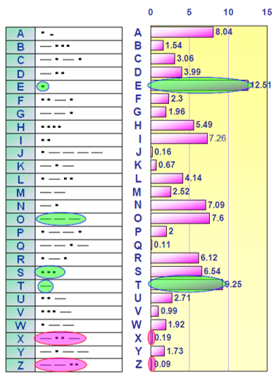
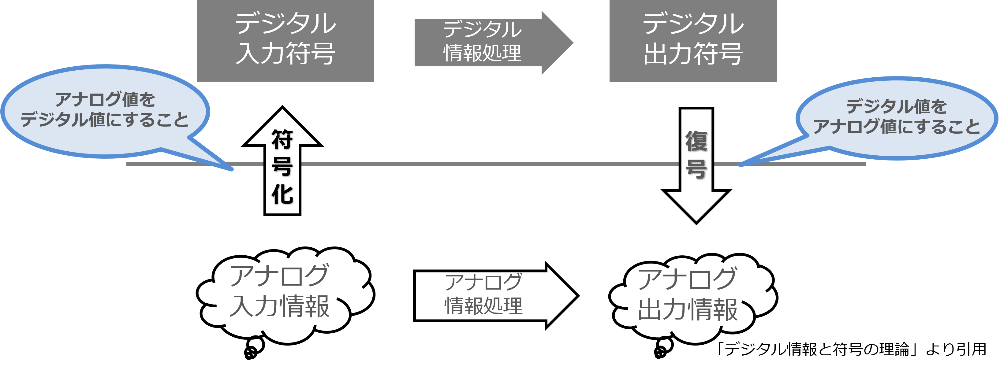

# デジタル電子回路

電子工学というくらいなので、この科目は電子回路について学ぶ。
電子回路は大別すると次の２つに分かれる：

- アナログ電子回路  
  アナログ信号を取り扱う回路  

- デジタル電子回路  
  デジタル信号を取り扱う回路  

電子工学概論では主にデジタル回路について学習する。

アナログとはなにか、デジタルとはなにか、はこれから学習する。

# 電子回路の役割

一例として、給水タンクの貯水量を一定に保つ仕組み（ダムでもお風呂でもなんでもよい）を自動化する電子回路を考えてみよう。

おそらく下の図のようなシステムを思い浮かべると思う。
このとき、センサーを使ってタンクの水位を電気信号に変換し、これが **入力** となる。その入力を電子回路が受け取ってなんらかの **処理 (計算)** を行なって、処理の結果を **出力** する。
給水タンクの例であれば、満水に近ければ水を放出するために弁を開き、渇水していれば弁を閉じて水を貯めるようにする。

  

このように、世の中に存在する電子回路のほとんどは、  

**「外部からなんらかの情報を取り入れて、それを処理して、その処理結果を信号として外部へ送り出す」**  

という動作をする。

# 事例研究

自分の身の回りを見て、電子回路を取り上げ、それの入力はなにで、どのような処理を行い、出力はなにか、スライド１枚にまとめ、Google Education に提出せよ。

- スライド作成 20 分程度
- 発表・質疑応答 3 分程度

# アナログ情報とデジタル情報

電子回路が扱う情報 (信号) は２つに大別される：

- アナログ (analog)  
  連続値（連続した値）を意味する。

- デジタル (digital)  
  離散値 （とびとびの値）を意味する。

たとえば時刻を考えてみよう。

時刻は 10:30 という時刻から始まり、次に秒の単位 10:30:25, 
ミリ秒の単位、マイクロ秒の単位… 10:30:25.390237851....... と無限に細かくするすることができる。人間が実用上困らない程度に、打ち切ってたものが「秒」とか「分」といった単位である。実際の時間は止まることなく流れており、その瞬間は無限に細かくすることができる。

これが典型的な **「アナログ情報」** である。

温度はどうだろうか？温度も 10 ℃と 11 ℃の間には、10.2 ℃ とか 10.25 ℃ とか 10.25489...℃ とかいくらでも無数に値を取ることができる。これも温度はぶつ切りではなく連続して変化するからである。

それでは、パチンコの玉はどうだろう。パチンコの玉を切ったり削ったりしないかぎりは、１個、２個、３個であり、1.5 個とか 4.3 個という数は出現しない。

ぶつ切りにした (これを「離散」という) 情報。これが**「デジタル情報」** である。

## モールス信号

みなさんは知らないかもしれないが「モールス信号」という通信用の信号がある。トントンツーツーと、短い音と長い音でアルファベットを構成する通信方式である。

- モールスが1832年に電信用に考案した符号でデータ圧縮の草分け
- 頻繁に現れる 'E' や 'T' に短い符号を、使用頻度の低い 'Y' や 'Z' に長い符号を割り当てることで通信時間を短縮する

  
  

# デジタル回路
コンピュータ (デジタル回路) はこれをさらにすすめて、ぶつ切りにした情報 (1,2,3,4,5,6,7...) を 0 と 1 の２つの値で表す。これは 0 を低い電圧 (0V)、1 を高い電圧 (5V, 3.3V) に対応づけて回路を単純化しているからである。

さて、そうすると 0, 1 はいいとして、2 や 3 はどうやって表現したらいいのだろうか。0 と 1 しか表現できないデジタル回路 (コンピュータ) で 2 や 3 やそれ以上を表現するときには扱う信号のケタをふやして表現する。

## 2桁の2進数表

| 10進数 | 2進数 | 備考 |
|---|---|--|
| 0 | 00 |
| 1 | 01 |
| 2 | 10 |
| 3 | 11 | ２桁で表現できる範囲
| 4 | 100 |
| 5 | 101 |
| 6 | 110 |
| 7 | 111 | ３桁で表現できる範囲
| 8 | 1000 |
| 9 | 1001 |
| 10 | 1010 |
| 11 | 1011 |
| 12 | 1100 |
| 13 | 1101 |
| 14 | 1110 |
| 15 | 1111 | ４桁で表現できる範囲

## 解説

この表は、0から15までの10進数の数を2進数に変換したものである。

2進数は、0と1の2つの数字を使って数を表す数体系である。10進数では、桁ごとに10種類の数字 (0から9) を使用しますが、2進数では0と1しか使用しない。

2桁の2進数では、最大で2^2 = 4種類の数を表すことができる。

## 使い方

この表は、2進数の勉強や、2進数と10進数の変換に役立つ。

例えば、10進数の5を2進数に変換するには、表の5番目の行を見る。すると、10進数の5は2進数では101であることがわかる。

また、2進数の101を10進数に変換するには、表の右側の列を見る。すると、2進数の101は10進数の5であることがわかる。

このとおり、ケタを増やせば表現できる値 (数) も増やすことができる。

この 0, 1 の１桁分を 1 bit (ビット) という。

# 写真や動画の画質

桁を増やせば表現できる情報量が上がる例として、Youtube の画質モードを見てみよう。
フル HD 画質 (2K) は (1920x1080ピクセル) の映像である。データ節約モードは (256x144ピクセル) の映像である。

その表現の差はまさに一目瞭然である。

  
  

# デジタル信号のまとめ

- デジタルというのは「不連続量」を扱う  
  階段みたいな信号と思えばいい
- １，２，３，４，５，６…（あいだの 1.5 とか 2.35 とかという数は考えない）
- とびとびの値は完全に元のアナログ値には戻らないが、桁を増やせば実用になる
- コンピュータやデジタル回路はさらに簡略して、０か１しか使わない
- 二進法という世界で考える

  

# 事例研究

身の回りにあるデジタルなもの・アナログなものを探してみよう
具体的な事例をあげ、

- それのどこが「デジタル」なのか
- それのどこが「アナログ」なのか

説明してください。

# 演習問題

- 解像度が 1920 x 1080 の 24 ビットフルカラー画像データの量は何 MB (メガバイ
ト) になるか計算してみよう。
- みんなのスマホの写真の画素数はいくらか？そこから計算される写真のデータサイズはいくらか？
- なぜ実際のファイルサイズはそれより小さいのか。理由を考察してみよう。
