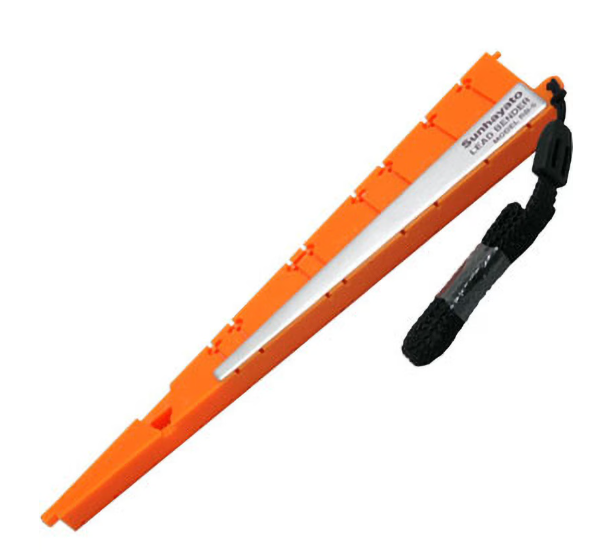

# 電子工学概論 実習編

- 電子工学概論では、主にデジタル回路 (ロジック回路) について実習を通じて理解を深める。

# 扱う部品について

実習で使う道具にや部品について説明する。

## ブレッドボード (キットで遊ぼう電子回路　基本編)

- ブレッドボードは 5 つの穴は横一列がつながっている
- 両脇の 2 列は縦方向につながっている (電源と GND 用のライン)
  この 2 列をうまくつかいこなすのがコツ

## ジャンパワイヤー
### ワイヤーの色について

- **赤色を + 、黒 (青) を - (GND) に使用する（よい子のお約束）**

その他の入出力については、自由な色を用いてよい。自分なりのルールを設けておかないとすぐぐちゃぐちゃになるぞ。

## 電池ボックス

電池ボックス自体にもスイッチがある。スイッチの入れ忘れ／切り忘れに注意！

## LED, 抵抗

今回の主役の２つの素子。
- LED は正しい方向に電気を流すと光る。逆方向には電気は流れない。
- 抵抗は電気の流れを阻止する (流れにくくする)。

## リードベンダ

抵抗など電子素子 (デバイス; device) のリード線を曲げるための道具。回路がきれいに仕上がる。

  

## テスター (マルチメーターともいう)

- 抵抗、電流、電圧などいろいろなものが測定できるので **マルチメーター**
- 実習室にあるタイプは一定時間、経つと自動的に電源が切れる  
   　電源が切れたら、一回ダイヤルを OFF にしてから使いたい機能に合わせる
- テスターも赤：電源、黒：GND のルールに従うこと  
    反対にしているととても素人っぽい

  

# LED 

**[LED のテスト方法](https://forum.digikey.com/t/led/6721)**

# LED を点灯させてみよう

1. **[キットで遊ぼう 基本編](https://drive.google.com/file/d/1brFCKkjgkIGj3gdQ6vRKIazKK5pOKPWZ/view?usp=classroom_web&authuser=0)**  
  pp.6 をやってみよう。  
まずはテスターやブレッドボードになれること。

1. **[キットで遊ぼう　基本編](https://drive.google.com/file/d/1brFCKkjgkIGj3gdQ6vRKIazKK5pOKPWZ/view?usp=classroom_web&authuser=0)**  
   pp.7 の回路を作成してみよう。  
回路を作成したら、写真をとって提出すること。

1. **[キットで遊ぼう 基本編](https://drive.google.com/file/d/1brFCKkjgkIGj3gdQ6vRKIazKK5pOKPWZ/view?usp=classroom_web&authuser=0)**  
   pp.10 をやってみよう。  
