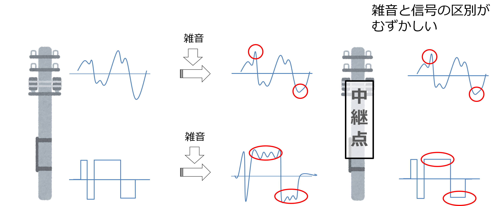
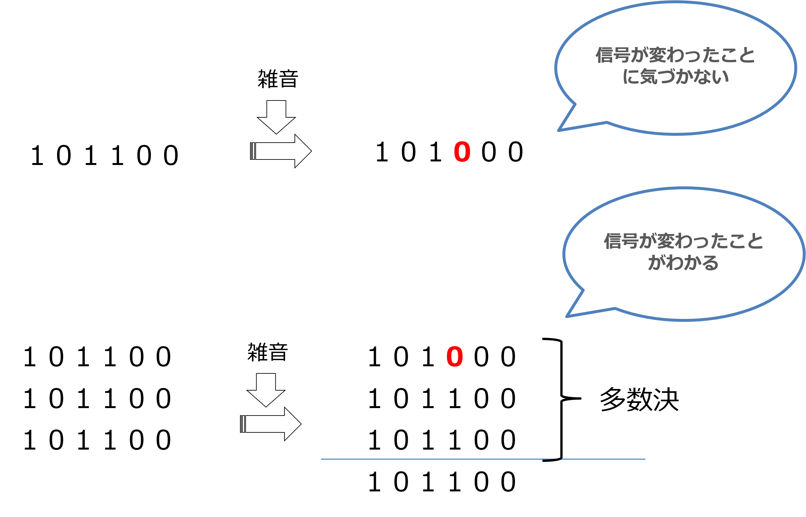
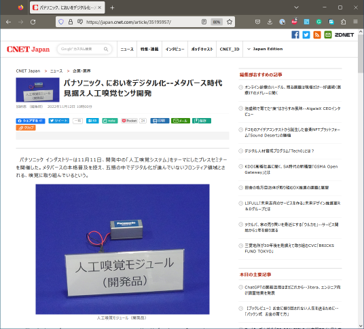

# デジタル情報処理の特徴

どうして世の中見渡してもこれほどデジタル情報一色になったのか。それはデジタルには、アナログにはない次のような長所があるためである。

## 信号の劣化を修復できる

- １・０を電圧 V[V] と –V[V] とする
- 途中さまざまな原因で信号に雑音が加わる
- アナログでは完全に元の信号に戻すことはできないが、デジタルなら修復可能

  

## 何度でも送ることができる

- 同じ符号を繰り返し３回送ることにする
- 多く受け取った符号を採用する
- これを「誤り訂正」という
- アナログでおなじ信号を再現することは難しい (必ず劣化する)

  

## マルチメディア化に対応する

- すべての情報は、つきつめると 0 か 1 のどちらか
- 文字、写真、音楽、映像 (0,1 をどう解釈するかはアプリケーション次第)  
- 情報を扱う桁はどんどん増える(情報量が増える)  
例）コンピュータ、テレビ、スマホのカメラ、CD (音楽) etc…

   
匂いもデジタル化する

# いろいろなスイッチ素子

## リレー

制御盤や PLC で慣れ親しんだものだ。
電気で動く機械式のスイッチ。構造は単純で電磁石によってアームが引き寄せられて、回路が開いたり閉じたりする。

- はじめ（初期状態）はスイッチが開いていて、入力があるとスイッチが閉じるものを...
- はじめ（初期状態）はスイッチが閉じていて、入力があるとスイッチが開くものを...

という。構造が単純で大電流をながせる。100年以上利用されている。欠点は動作が遅く (ミリ秒)、消費電力が大きい。

## 真空管

真空管も電気の ON/OFF を制御できる。つまりスイッチの作用をする。
動作が早い、温めないと安定しない、などの特徴がある。

## トランジスタ (MOS-FET)

半導体を利用したスイッチング素子。現代のコンピュータはトランジスタの組み合わせでできている。

## n-MOS

## p-MOS

# 論理演算 / 論理関数

## NOT

## AND

## OR

## 集合論とベン図

# コンピュータの中身をみてみよう

- メモリとは何をする装置か
- いまもっとも使われている CPU は何ビットを一度に処理するか
