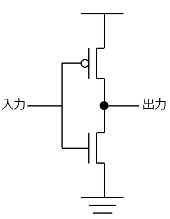
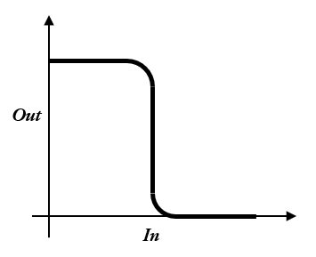

# NOT 回路

NOT 回路を p-MOS, n-MOS で作ってみよう。
何ボルトを 0 とし、何ボルトを 1 するかは、いろいろな流儀がある。特に 1 は必ずしも 1 ボルトではない。昔は 5V が 1 だったが、いまは 1.8V など低くなる傾向にある。

このように、n-MOS と p-MOS を巧みに組み合わせた FET 回路を c-MOS 回路という。
c は complimentary の頭文字で、相補的、つまりお互いを補完する、という意味である。
以下、これを c-MOS という。c-MOS 回路はいつもどちらかの FET が OFF になっているため、電力を使うのは出力が切り替わるときだけであり、低消費電力が図れる。現在の論理回路はほとんど C-MOS 回路になっている。

  
  　　　　
  

  n-MOS と p-MOS を使った NOT 回路とその出力

# NAND 回路

NAND というのは AND の否定 **NOT(AND)** のことで AND の結果を否定したものである。
AND の回路の出力を否定の入力に入れ