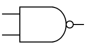
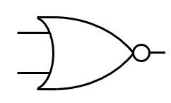
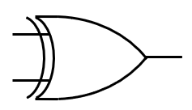
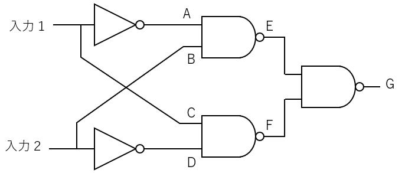

# NOT 回路

p-MOS, n-MOS で NOT 回路を 作ってみよう。
何ボルトを 0 とし、何ボルトを 1 するかは、いろいろな流儀がある。
特に 1 は必ずしも 1 ボルトではない。
昔は 5V が 1 だったが、いまは 1.8V など低くなる傾向にある。

このように、n-MOS と p-MOS を巧みに組み合わせた FET 回路を c-MOS 回路という。
c は complimentary の頭文字で、相補的、つまりお互いを補完する、という意味である。
以下、これを c-MOS という。c-MOS 回路はいつもどちらかの FET が OFF になっているため、電力を使うのは出力が切り替わるときだけであり、低消費電力が図れる。現在の論理回路はほとんど C-MOS 回路になっている。

  
  　　　
   
  c-MOS による NOT 回路

- OR 回路、AND 回路も C-MOS (n-MOS と p-MOS を４つ組み合わせる) で作れる。10 分ほど、考えてみよう。

これで NOT, OR, AND の３つの基本論理回路が MOS で作れることがわかった。

なお、論理式では、頭にバーをつけて表現する。

- 入力 A の否定： ${\overline{A}}$

# NAND 回路

NAND というのは AND の否定 **NOT(AND)** のことで AND の結果を否定したものである。
AND の回路の出力を否定の入力に入れ、入力が 0 だったら 1, 1 だったら 0 になる回路を NAND という。
真理値表を確認するとわかるが、出力が 0 になるのは入力が 1, 1 のときだけである。このことから **ゲート回路** ともいう。

あとで改めて説明するが、NAND 回路があればすべての論理回路を作ることができる。そのため、NAND 回路は **万能回路** と呼ばれることもある。

- 入力 AB のNAND： $\overline{A\cdot B}$ または $\overline{AB}$

   
  NAND の MIL 記号

| 入力 1|入力2| AND | 出力 |
|------|-----|----|----|
|  0   | 0 |
|  0   | 1  |
|  1   | 0  |
|  1   | 1  |

**NAND の真理値表 (Truth table)**

# NOR 回路

NOR は、OR の前に N がついている回路である。NOR は２つの有力に対して出てきた出力を否定の回路を通したものである。回路図も OR 回路の先に丸をつけてひっくりかえっていることを示す。

NOR 回路も NAND 同様、すべての論理回路を作ることができる。すなわち NOR 回路も万能回路である。

- 入力 AB の NOR： $\overline{A + B}$
 

   
  NOR の MIL 記号

| 入力 1|入力2| OR | 出力 |
|------|-----|----|----|
|  0   | 0 |
|  0   | 1  |
|  1   | 0  |
|  1   | 1  |

**NOR の真理値表 (Truth table)**

## AND 回路と OR 回路

FET (半導体) を使った場合には電気的特性から NAND 回路や NOR 回路しかできない。
ここでは NAND 回路からどうやって AND 回路を構成するか、説明する。

- NAND 回路の出力を反転 (否定) すれば AND 
- NAND 回路の２つの入力を同じにすると NOT 回路になる

この組み合わせで NAND 回路から AND 回路ができる。

OR 回路も同じ要領で NOR 回路を作り (NAND 回路で NOR も作れる。それには **ド・モルガンの法則** が必要だ。そして実際の製品はそのようにできている)、その出力を NOT 回路で否定するように構成する。

# EXOR (EOR) 回路 (Exclusive OR)

Exclusive OR を説明する。Exclusive というのは「のけ者」にするという意味で、排他的と訳す。つまり EXOR は日本語では「排他的論理和」という。排他の言葉の意味は、両方揃ったときは　**偽 (False)**　という点から来ている。
 
- 入力 AB の EXOR： $A \oplus B$
 

   
  EXOR の MIL 記号

| 入力 1|入力2| 出力 |
|------|-----|----|
|  0   | 0 |
|  0   | 1  |
|  1   | 0  |
|  1   | 1  |

**EXOR の真理値表 (Truth table)**

## EXOR 回路
EXOR の回路を示す。この回路が確かに EXOR を表現しているか、真理値表を埋め、EXOR になっているか確認しよう。

   
  NOT と NAND で構成した EXOR 回路

| 入力 1|入力2| A | B | C | D | E | F | G |
|------|-----|---|---|---|---|---|---|----|
|  0   | 0  |
|  0   | 1  |
|  1   | 0  |
|  1   | 1  |

**EXOR の真理値表2 (Truth table)**
