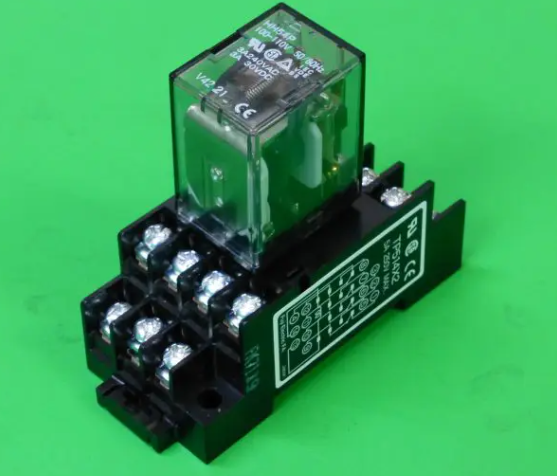
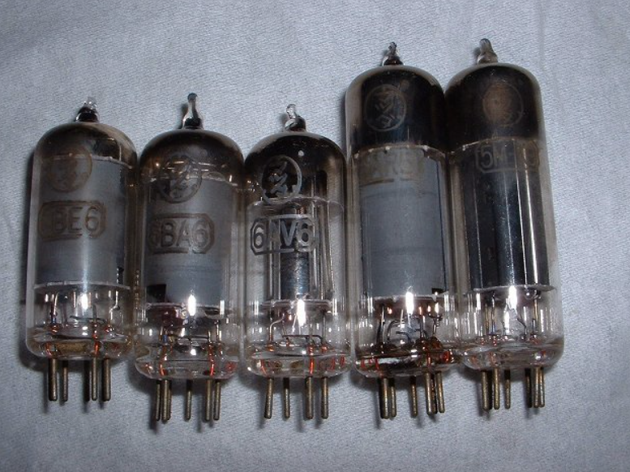
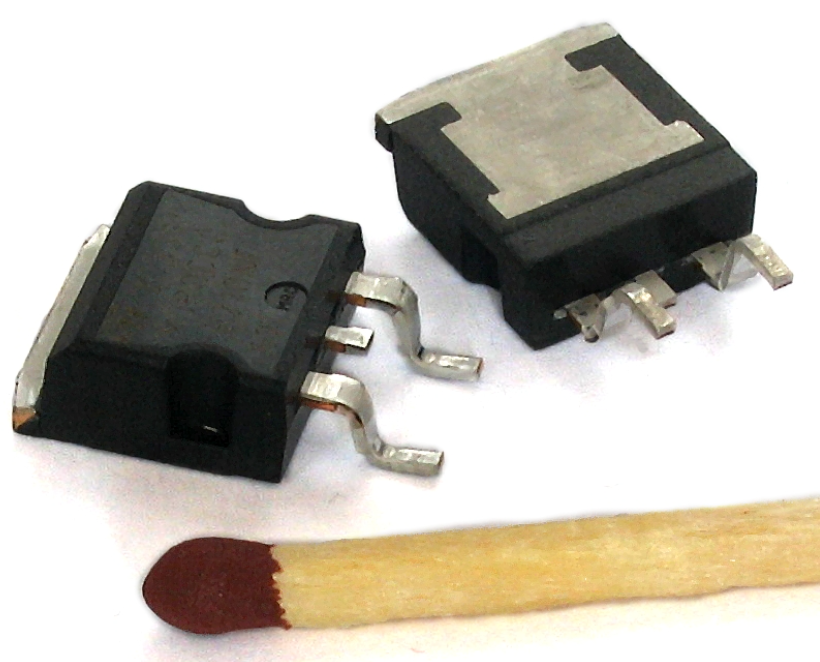
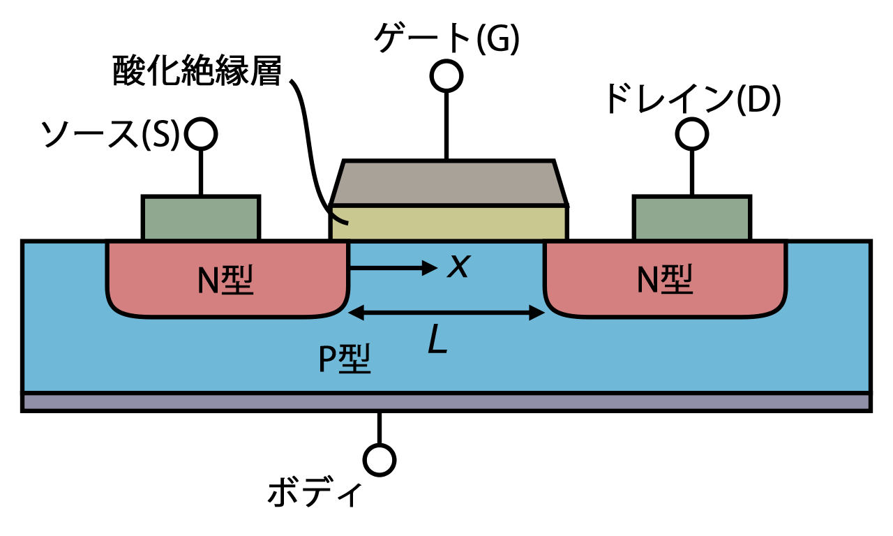

# デジタル情報処理の特徴

どうして世の中見渡してもこれほどデジタル情報一色になったのか。それはデジタルには、アナログにはない次のような長所があるためである。

## 信号の劣化を修復できる

- １・０を電圧 V[V] と –V[V] とする
- 途中さまざまな原因で信号に雑音が加わる
- アナログでは完全に元の信号に戻すことはできないが、デジタルなら修復可能

  

## 何度でも送ることができる

- 同じ符号を繰り返し３回送ることにする
- 多く受け取った符号を採用する
- これを「誤り訂正」という
- アナログでおなじ信号を再現することは難しい (必ず劣化する)

  

## マルチメディア化に対応する

- すべての情報は、つきつめると 0 か 1 のどちらか
- 文字、写真、音楽、映像 (0,1 をどう解釈するかはアプリケーション次第)  
- 情報を扱う桁はどんどん増える(情報量が増える)  
例）コンピュータ、テレビ、スマホのカメラ、CD (音楽) etc…

   
匂いもデジタル化する

# いろいろなスイッチ素子

## リレー

制御盤や PLC でみんな触れていることと思う。
電気で動く機械式のスイッチ。構造は単純で電磁石によってアームが引き寄せられて、回路が開いたり閉じたりする。

   

- はじめ（初期状態）はスイッチが開いていて、入力があるとスイッチが閉じるものをなんという？
- はじめ（初期状態）はスイッチが閉じていて、入力があるとスイッチが開くものをなんという？

特徴は、構造が単純で大電流を流せる。歴史が長く 100 年以上利用されている。欠点は動作が遅く (ミリ秒)、消費電力も大きい。

## 真空管

真空管も電気の ON/OFF を制御できる。すなわちスイッチの作用をする。
動作が早い (マイクロ秒)、温めないと安定しない、寿命が短い、などの特徴がある。
真空管で作られたコンピュータもあったが、真空管が頻繁に切れてしまい、そのたびに差し替えなければならないかった。

   

- **[エニアック](https://ja.wikipedia.org/wiki/ENIAC)**

## トランジスタ (MOS-FET)

半導体を材料にしたスイッチング素子。1 マイクロメートルより小さい素子が作れる。
MOS-FET の名称の MOS は meta-oxiside semicoductor の略で物的な構造を表している。
FET は field effect transistor の略で、電界効果という現象を利用した半導体であることを表している。

電界効果とは、電圧をかけると電子が存在したり、いなくなったりする現象をいうう。

「モス・エフイーティー」や「モスフェット」と呼ばれる。

現代のコンピュータはこの MOS-FET が数十～数兆レベルで組み合わさってできている。

   

## 集積回路 (IC)

小さいトランジスタを作ることができた結果、集積回路が使えるようになった。
１つの半導体の上に複数のトランジスタを作る技術。
現在は数が増えて、集積回路の数 (トランジスタ) は億を超えている。

ムーアが「半導体の集積回路（集積率）は指数的に増えていく」という指摘をした。
これを**「ムーアの法則」**という。

- **[ムーアの法則](https://feeldenko.com/diy-fa/moores-law-smartphone/)**

### n-MOS

n-MOS は負の電荷 (電子) を使って電流の流れを制御する。

図のソース(S)-ドレイン(D) 間の電流をゲート(G) で制御する。
G に正の電圧をかけると、電子が近づき、S,D の２つの電極がオンになる。
つまり、G に電圧をかけることによって、ソース・ドレインの２つの電極間をオンにしたり、オフにしたりできる。

  

### p-MOS

p-MOS は正の電荷 (正孔) を使って電流の流れを制御する。

G に負の電圧をかけると、正孔が近づき、S,D の２つの電極がオンになる。
つまり、G に負の電圧をかけることによって、ソース・ドレインの２つの電極間をオンにしたり、オフにしたりできる。

# 論理演算 / 論理関数

## NOT

## AND

## OR

## 集合論とベン図

# コンピュータの中身をみてみよう

- メモリとは何をする装置か
- いまもっとも使われている CPU は何ビットを一度に処理するか
