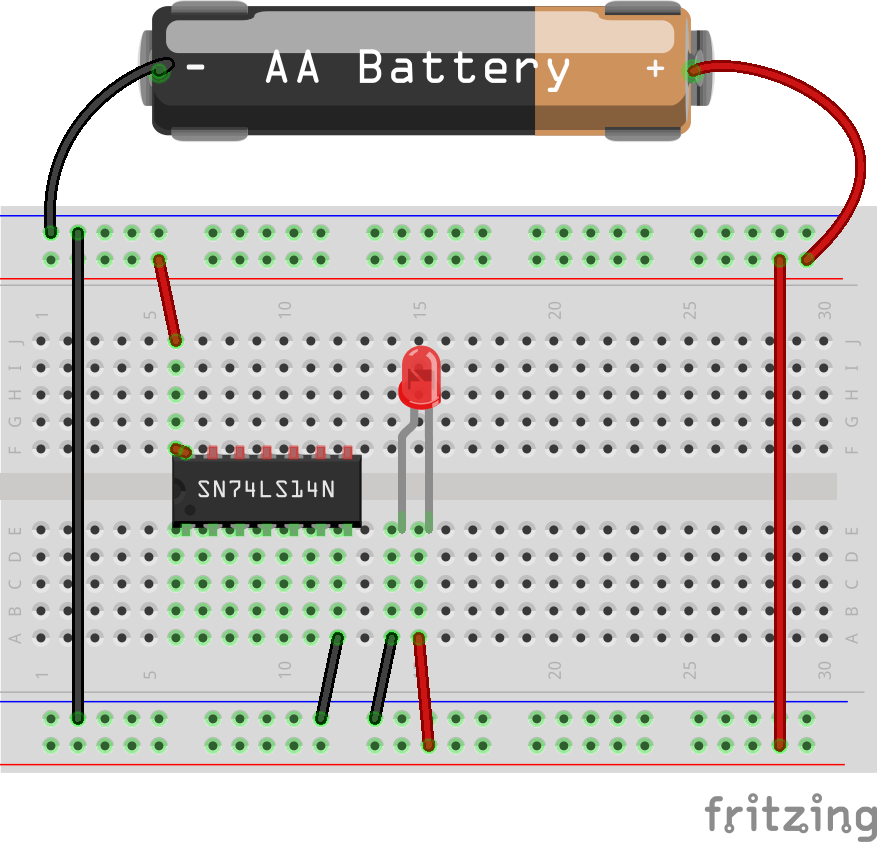
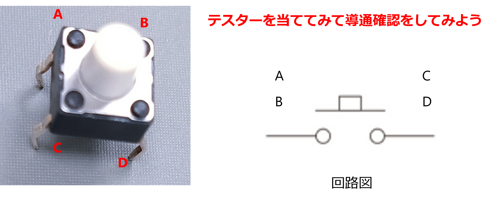
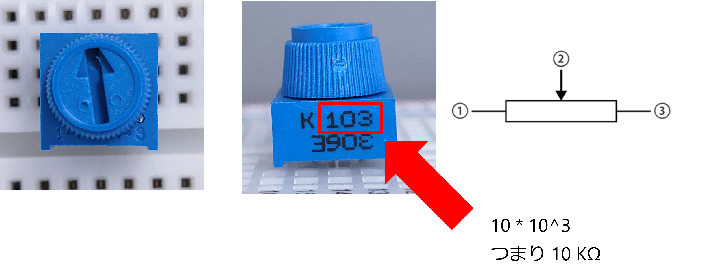
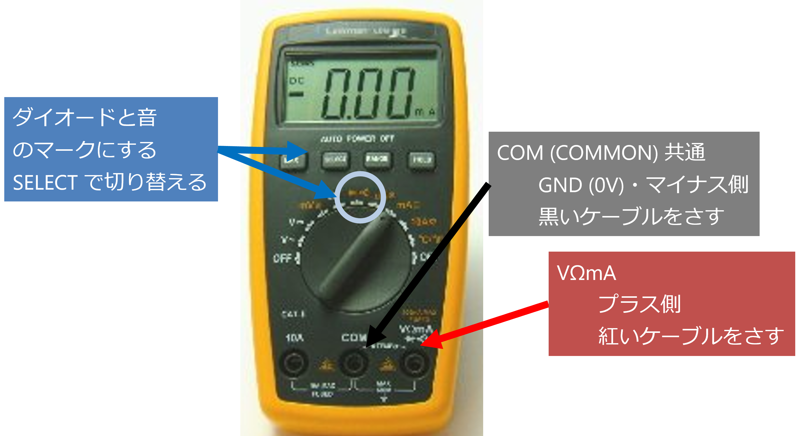

# 電子工学概論 実習編

- 電子工学概論では、主にデジタル回路 (ロジック回路) について実習を通じて理解を深める。

# 扱う部品について

## ブレッドボードの使い方

- ブレッドボードの中央 5 つの穴は横一列がつながっている
- 両脇の 2 列は縦方向につながっている (電源と GND 用のライン)
  この 2 列の使い方がキモといえばキモ

- (A) のように飛び飛びで接続する方法もある
- (B) のように電源ラインと GND ラインをつかって接続する方法もある
- 回路が複雑になってくると (B) のほうがスッキリする

  
  

## ワイヤーの色について

次の 1 点だけ注意すること：

- **赤色を + 、黒 (青) を - (GND) に使用する**

その他の入出力については、自由な色を用いてよい。

## タクトスイッチ

- A と B、C と D はもうつながっているので注意！スイッチとしては機能しない！
- A と C の組み合わせ、B と D の組み合わせ、はたまた A とD か B と C の組み合わせで使う

  

## 可変抵抗

- 両端の①と③に電圧をかけ、②で抵抗比に応じた電圧を読み取る
- 最大抵抗は印字されているので、読めるようにしておく

  

## テスター (マルチメーター)

- 抵抗、電流、電圧などいろいろなものが測定できるので **マルチメーター**
- 実習室にあるタイプは一定時間、経つと自動的に電源が切れる  
    そうなったときは、一回ダイヤルを OFF にしてから希望の機能に合わせる
- テスターも赤：電源、黒：GND のルールに従うこと  
    反対にしているととても素人っぽい

  

# NOT 回路を使った演習

1. ブレッドボード上に **参考資料 [キットで遊ぼう](https://drive.google.com/file/d/1WIyxlVxO4KOCsrXA1GkVM40NIVW6Vxit/view?usp=sharing)** pp.11 の回路を作成よ。
1. ブレッドボード上に **参考資料 [キットで遊ぼう](https://drive.google.com/file/d/1WIyxlVxO4KOCsrXA1GkVM40NIVW6Vxit/view?usp=sharing)** pp.20 の回路を作成よ。
1. 作成した回路の可変抵抗を変化させて、入力電圧が何 V のときLED が点灯するか、確認せよ。

# マルチバイブレータの作成

マルチバイブレータ回路は、**「ピッピッ」と音を鳴らしたり、「カチッ」とスイッチを切り替えたり** できる電子回路である。

**どんなことができるか**

* **自動で「ピッピッ」と音を鳴らす！**: 目覚まし時計やタイマーに使われていて、朝起こしてくれる。
* **「カチッ」とスイッチを切り替える！**: 風車のモーターを回したり、車のウインカーを点滅させたりする。
* **光を「ピカピカ」と点滅させる！**: LEDライトを点滅させたり、イルミネーションを作ったりする。

**どんな仕組みなの？**

マルチバイブレータはトランジスタ (ここでは NOT 回路) とコンデンサと抵抗で構成することができる。

1. **トランジスタ**: トランジスタは、スイッチ
2. **コンデンサ**: コンデンサは、電荷を貯めておくことができる
3. **抵抗**: 抵抗は、電流の流れを調整する

- ブレッドボード上に **参考資料 [キットで遊ぼう](https://drive.google.com/file/d/1WIyxlVxO4KOCsrXA1GkVM40NIVW6Vxit/view?usp=sharing)** pp.25 の回路を作成よ。
- コンデンサに電荷が蓄えられるスピードは抵抗の値で決定する。抵抗値やが大きければ電流が抑えられるため、充電に時間がかかる。よって切り替えスピードが遅くなる。もちろんコンデンサの容量が大きくても充電に時間がかかる。同様に切り替えスピードは遅くなる。つまり、マルチバイブレータの周波数はコンデンサの容量と抵抗の大きさの積で決定する(第3クォータの電子回路実習でも出てきます)。

