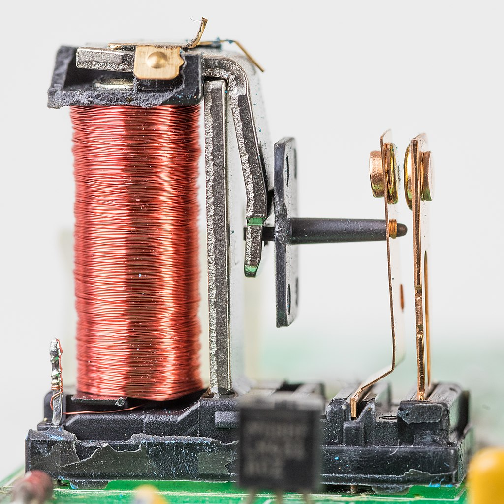
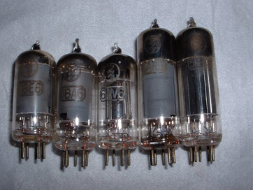
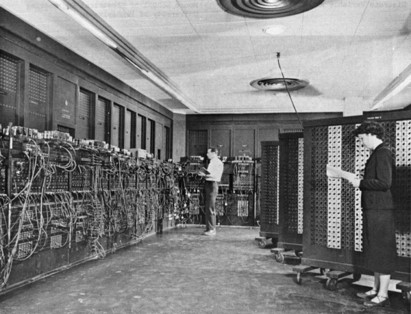
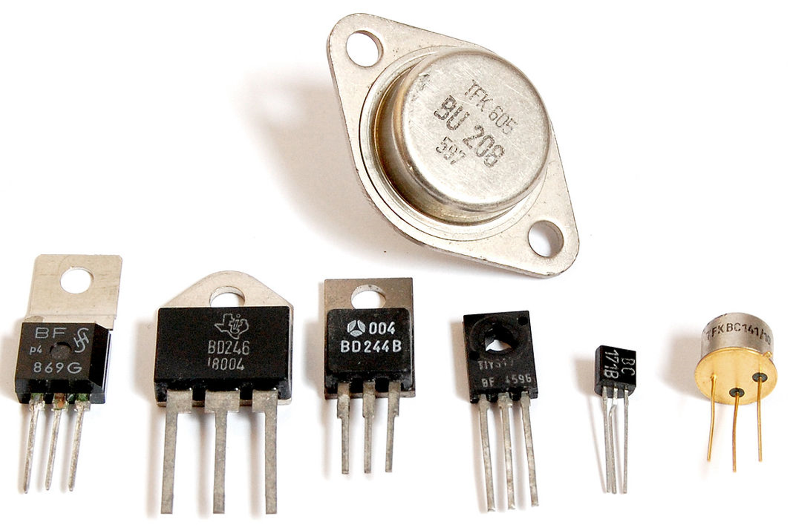
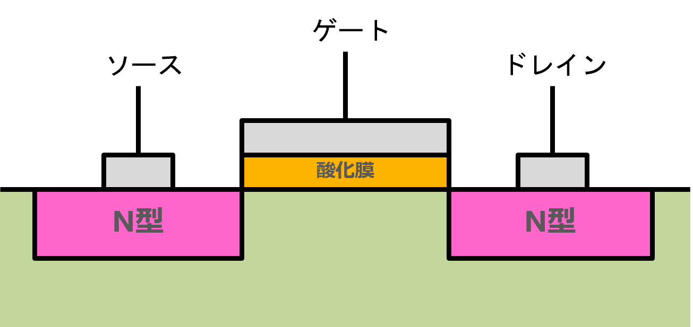
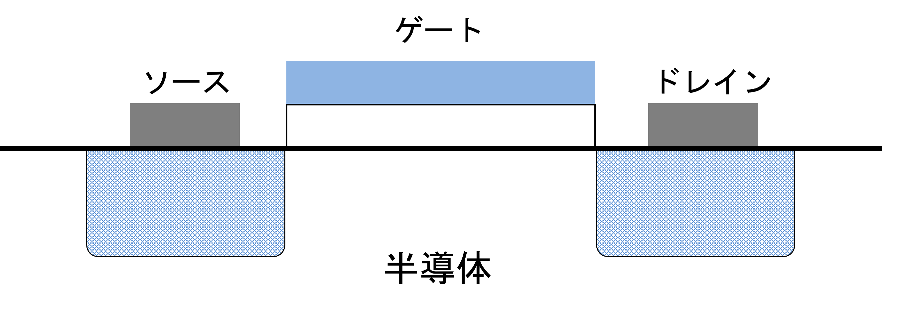
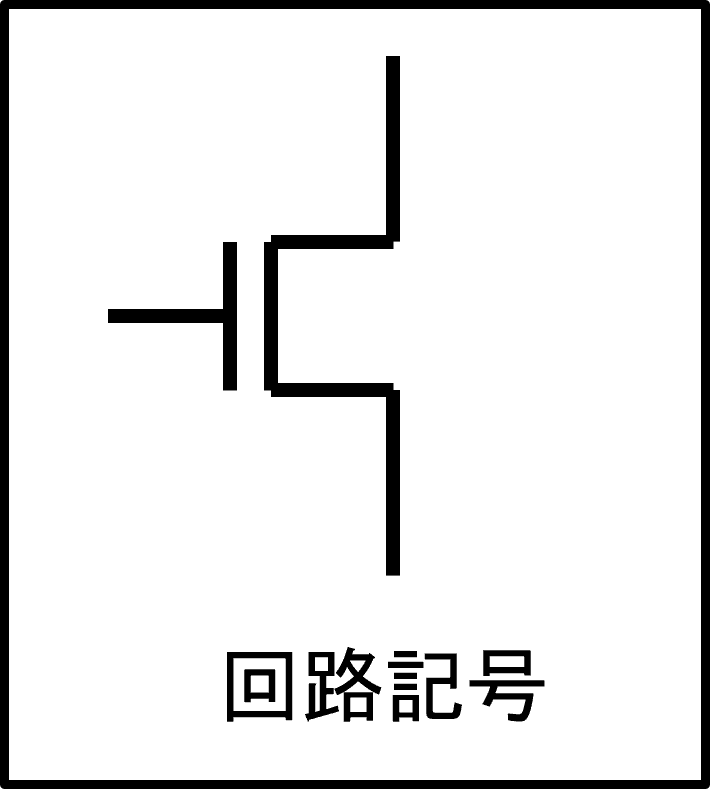
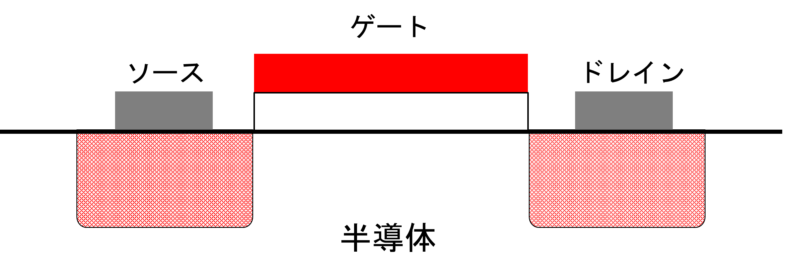
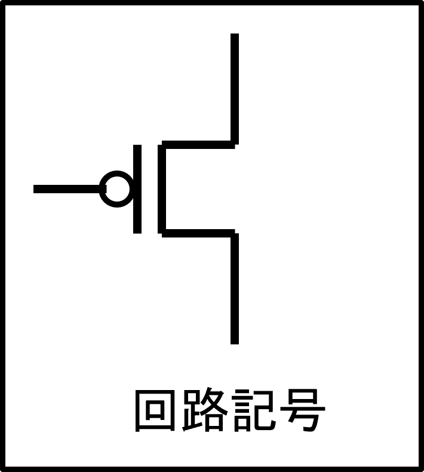
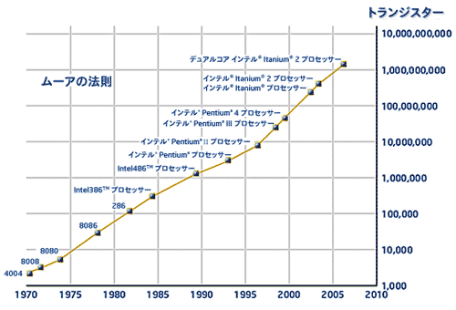

# スイッチ素子

コンピュータ (デジタル回路) を構成する回路の基礎となるのが、論理回路である。
論理回路は、電気信号により開閉させるスイッチを使って構成される。ここでは、いろいろなスイッチ、特に現在、主として使われている半導体スイッチである FET を中心にその構造や機能について述べる。

## スイッチ素子

論理回路の入出力は 2 進化されており、0 と 1 のみで構成されている。
回路というからには電気信号を処理する回路であり、0 は 0V の電位であるが、1 はふつう、正の電源電圧 Vh とする。このような２つの状態しかない信号を処理するには、なんらかのスイッチ素子 (switching device) を用いる。

### リレー

- １００年以上前から使われている
- 電磁石とバネで動く
- 物理的な開閉機構なので摩耗など経年劣化が伴う
- 電力を使う
- 動作が遅い（1/100 ~ 1/1000 秒程度）
- 家電 (車のウィンカーとか) で「カチッ」というのはリレーが切り替わっている音

  

### 真空管

- 真空中に電子を流す
- 電極に負の電圧をかけると電子が流れなくなる
- 電極に正の電圧をかけると電子が流れる
- 動作速度はマイクロセカンド(１秒に 10の6 乗、100 万回)
- 電子を真空に出すために温めるヒーターが必要
- ヒーターが切れるため寿命が短い

  

#### ENIAC

弾道ミサイルの軌道計算のために作られたコンピュータ。約1万8800本の真空管を使い、消費電力150キロワット、重さ30トンに及ぶ巨大な機械であった。

  

### トランジスタ

ここからがいわゆる **半導体** ！

- ヒーターがいらず、長寿命
- 動作が高速
- 1 μm より小さいトランジスタも作れる（髪の毛の 1/80 が 1μm ）
- 三端子（三本足）の素子
- コンピュータ（デジタル回路）はこのトランジスタだけを使ってほとんどを作り上げてい-る
- トランジスタの動作を理解すると、コンピュータ全体の動作も理解できる

  

# トランジスタの仕組み (MOS-FET)

トランジスタも作り方やその機能によっていろいろなものがあるのだが、ここではコンピュータに主に利用されている MOS 電解効果トランジスタ (MOS field-effect tarnsistor), 略して MOS FET について説明する。

MOS とはそのトランジスタの構造を表している。

- **M … メタル (金属)**
- **O … オキサイド (酸化物)**
- **S … セミコンダクター（半導体）**

   
  n-MOS FET の断面図

- **電界効果 (Field Effect)**
電圧をかけると電子が集まったり、いなくなったりする現象。

## 水道とMOS-FETの意外な共通点

MOS-FETは、3つの部品でできている。

* **ゲート（G）**: 蛇口のハンドルのような部分。電圧という「信号」を入力する。
* **ソース（S）**: 水道のホースの出口のような部分。入力される電流の「源」となる。
* **ドレイン（D）**: 水が流れ出る場所。出力される電流の「出口」となる。

ゲートに電圧をかけると、まるで蛇口を開けるように、ソースとドレインの間の道が開通する。電流が流れ出す。逆に、電圧を下げると道が閉じて電流が止まる。これが、MOS-FETの基本的な仕組みである。

## N型とP型、2つのタイプ

MOS-FETには、N型とP型の2種類がある。N型は、ゲートにプラスの電圧をかけるとオンになる。一方、P型はマイナス電圧が必要。これは、水道蛇口の開け閉めと似ている。

## スイッチングと増幅、MOS-FETの得意技

MOS-FETは、主に2つの役割を担う。

* **スイッチング**: 電流のオン・オフを高速で切り替える。まるで電気の点滅スイッチのような役割である。パソコンやスマホのCPUはこの機能を使って複雑な計算をしている。
* **増幅**: 小さな電流を大きな電流に変換する。まるでトランジスタのような役割である。スピーカーの音量を上げたり、ラジオの微弱な電波を大きくしたりするのに役立っている。

# n-MOS FET

- n はネガティブ (negative) の頭文字
- 電子を使って電流の流れを制御する
- ゲートに + の電気 (正の電圧) をかけると電子が制御端子 (ゲート) の下にいやすくなり、その結果、ソース-ドレイン間に大きな電流が流れる
- ゲートに - の電気 (負の電圧) をかけると電子が制御端子 (ゲート) の下にいづらくなり、その結果、ソース-ドレイン間の電流は流れにくくなる

  
  
   

# p-MOS FET

- p はポジティブ (positive)) の頭文字
- 正孔を使って電流の流れを制御する
- 構造や動作は n-MOS FET の反対
- ゲートに - の電気 (負の電圧) をかけると正孔が制御端子 (ゲート) の下にいやすくなり、その結果、ソース-ドレイン間に大きな電流が流れる
- ゲートに + の電気 (正の電圧) をかけると電子が制御端子 (ゲート) の下にいづらくなり、その結果、ソース-ドレイン間の電流は流れにくくなる
- 制御端子 (ゲート) の電圧の作用が反対のため、制御端子 (ゲート) に否定を意味する ◯ をつけて表す

  
  

# 集積回路

チップと呼ばれる 1cm 程度の半導体の上にトランジスタやその他の部品も多量に搭載したものを集積回路 (Integrated Circuit, IC) という。

- 1967年、テキサス・インスツルメンツ社が電子式卓上計算機（電卓）を開発
- 日本でも 70 年代終わりまで熾烈な「電卓戦争」を展開
- 集積度は年代ごとに上昇
    - LSI  (large scale integration)	１万程度個以下
    - VLSI (very large scale …)		１０万程度個以下
    - ULSI (ultra large scale …)		１００万程度個以下
    - ELSI (extra large scale …)		１０００万程度…
    - システム LSI

  

[終焉したのか、ムーアの法則？](https://www.semiconportal.com/archive/blog/insiders/oowada/post-205.html) より

## ムーアの法則とは？

インテル創業者の一人であるゴードン・ムーア氏によって論じられた、半導体の集積率に関する経験則である。

**内容**: **「半導体の集積率は18ヶ月で2倍になる」**

つまり、同じ面積のシリコンチップ上に搭載できるトランジスタ数の数は、18ヶ月ごとに2倍になるということ。

**例え**

例えば、あるチップに1000個のトランジスタが搭載されている場合、ムーアの法則に従えば、18ヶ月後には同じ面積のチップに2000個のトランジスタが搭載できるようになる。
