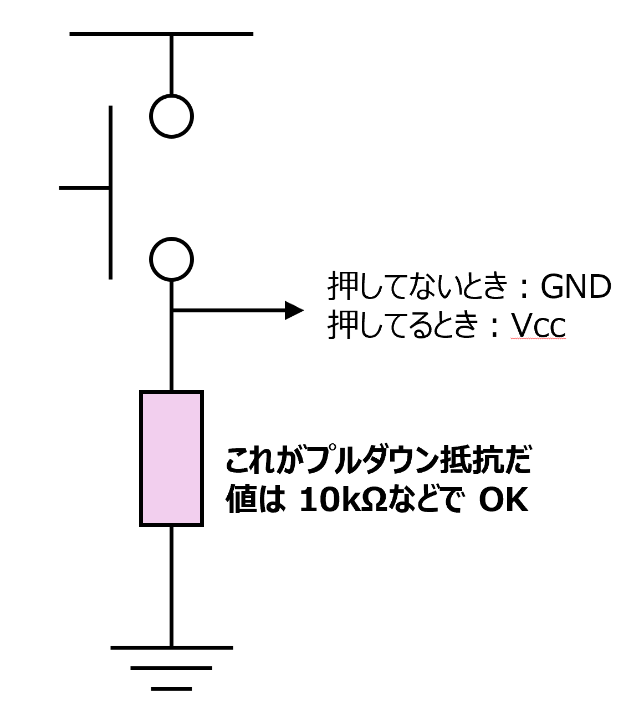
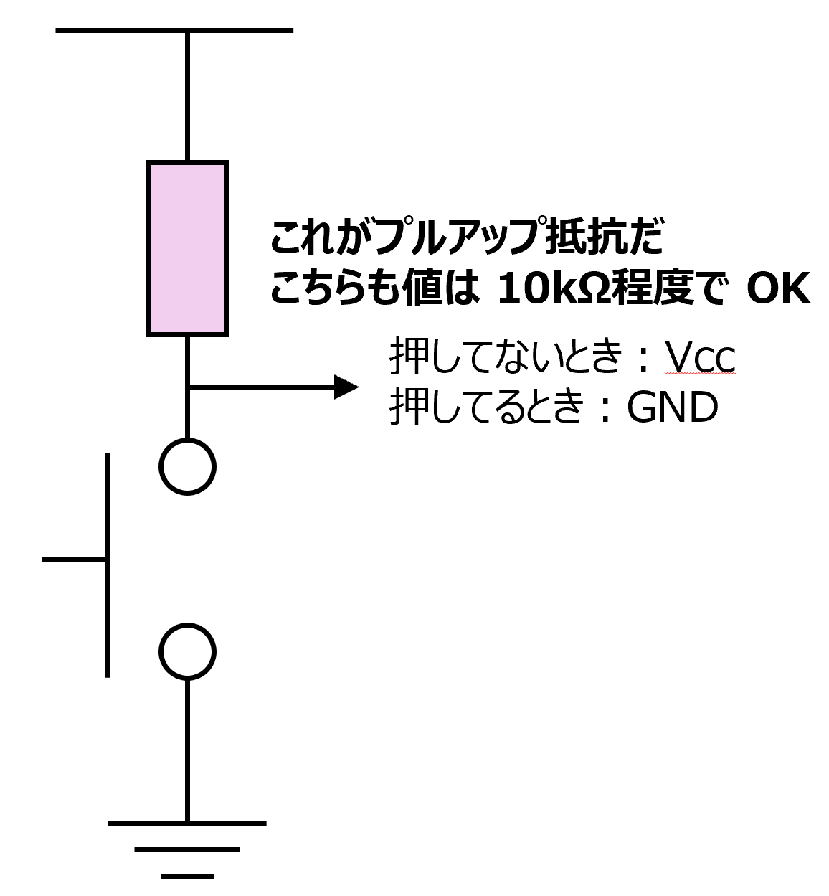

# 「動く回路」の作り方

今日、学ぶこと：

1. なぜ回路は動かない？: 失敗の最大の原因、「宙ぶらりん（Floating）」を理解する。
2. 動く回路の「お作法」: 「プルアップ/プルダウン抵抗」の役割をマスターする。
3. プロの「黄金手順」: デバッグ（間違い探し）が簡単な、回路の正しい組み立て方を学ぶ。

# 「宙ぶらりん (Floating)」を克服せよ

ロジック (論理) IC（74HCシリーズなど）は、「CMOS」という種類のトランジスタで作られており、このICには、非常に敏感な「クセ」がある。

- ICの入力ピンは、必ず「1 (Vcc)」か「0 (GND)」のどちらかに接続されていなければならない。

**「どこにも接続されていない」** 状態を避けないといけない。
この「どこにも接続されていない」状態を、**「宙ぶらりん」または「フローティング (Floating)」** と呼ぶ。

## 「宙ぶらりん」の恐怖

入力ピンがフローティング状態だと、まるで　**「風の中の旗」**　のようになる。
目に見えないノイズ（電灯のノイズ、ラジオの電波、皆さんの体から出る静電気など）をアンテナのように拾ってしまい、
入力が「0」になったり「1」になったり、ランダムにバタバタと暴れてしまう。

論理設計が完璧でも、肝心の入力がデタラメでは、正しい答え（出力）が出るはずがない。これをまず克服しよう。

# 入力を「縛り付ける」お作法

どうすれば入力ピンを「0」か「1」に安定させられるのか？
答えは　**「抵抗を使って、入力ピンをGNDかVccに『縛り付ける』」**。

## プルダウン抵抗 (Pull-down Resistor)

「スイッチが押されていない時は、入力ピンをGND(0V)に固定したい」という時に使う。

1. スイッチOFFの時:  
入力ピンは、10kΩのような（比較的大きめな）抵抗を通じて、GNDに接続されている。  
これにより、入力ピンはノイズに惑わされず、**安定して「0」** になる。

2. スイッチONの時:  
Vcc (5V) から来た電気は、抵抗を通るルート（面倒）と、スイッチを通るルート（楽）に分かれる。  
電気は抵抗が小さい（楽な）ほうを好むので、ほぼ全ての電気が入力ピン側に流れ込む。  
結果、入力ピンは **安定して「1」** になる。

補足：プルアップ (Pull-up) 抵抗 この逆で、「スイッチが押されていない時は、入力ピンをVcc(1)に固定したい」場合は、抵抗をVcc側に接続する。これをプルアップと呼ぶ。どちらを使ってもOKいいが、今回は「プルダウン」で統一して覚えよう。

  
  

# 回路を組む「黄金手順」一気に組むな！

回路が動かないつぎの理由は、「全部を一気に組むから」である。1000 行のプログラムを全部書いて、一度もテストせずに「実行」ボタンを押すようなもので、バグ（間違い）があっても、どこにあるか分からない。

プロは、 **「検証できる小さなかたまり（モジュール）ごと」** に作って、都度テストする。

❌ ダメな手順 (たぶん前回やったこと)
1. 全部のICをブレッドボードに挿す。
2. 電源、GND、入力SW、IC間、LED…すべての配線を一気に繋ぐ。
3. 最後に電源を入れる。
4. 動かない。
5. パニック！ → どこが悪いか、まったく分からない。

## 「黄金の手順」

### 1. 【電源の検証】:

- ブレッドボードの電源ライン（＋とー）にVccとGNDを接続する。  
- **テスト:** テスターで、ICを挿す予定の場所のVccとGNDの間に、正しく5Vが来ているか確認する。

### 2.【入力の検証】:

- スイッチとプルダウン抵抗を使った「入力回路」を1個だけ作る。
- **テスト:** その入力ピンの先に、直接LED（＋電流制限抵抗）を繋ぐ。スイッチを押して、LED が点灯/消灯するか確認する。
- これが動けば、「入力モジュール」は完成だ。

### 3.【IC（ゲート）の検証】:
- ICを1個だけ挿し、VccとGNDを真っ先に接続する。
- 【2】で動作確認した「入力」を、そのICの入力ピンに接続する。
- ICの出力ピンに、直接 LED を繋ぐ。
- **テスト:** スイッチを操作し、そのゲート（例: AND）の真理値表通りにLEDが動くか確認する。

### 4.【連結】:
- 動くことが保証された部品（モジュール）同士を、一つずつ繋いでいく。
- もし動かなくなったら？ → 最後に繋いだ線が怪しい、とすぐに分かる。

# 実習

**課題：** ３入力の AND 回路を構築せよ

- できたら先生を呼んで動作確認してもらう
- OK だったら (回路がわかるように) 写真を撮って、Education にアップ

**発展課題：** ４入力の AND 回路を構築せよ

- できたら先生を呼んで動作確認してもらう

**絶対ルール：** 

1. 3つの入力スイッチすべてに、プルダウン抵抗を必ず付けること。
2. **「黄金手順」** を厳守すること。
3. 特に「手順2：入力の検証」を飛ばさないこと。
