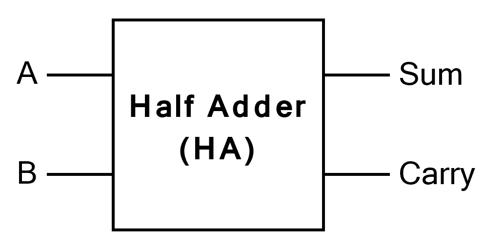
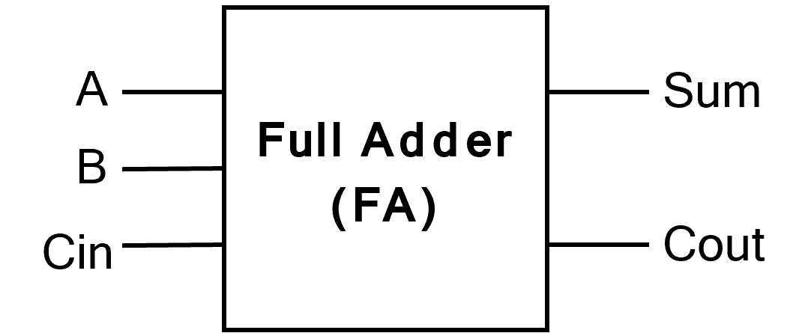

# 🎓 第7回：コンピュータの心臓部！「加算器」

## 1\. 今日のゴール

  * **ゴール**: コンピュータが「足し算」を行うための基本回路、\*\*加算器（Adder）\*\*の仕組みを設計できるようになる。
  * **流れ**:
    1.  まず、一番シンプルな「1桁 + 1桁」の\*\*半加算器 (Half Adder)\*\*を設計する。
    2.  次に、桁上がりを考慮した「1桁 + 1桁 + 桁上がり」の\*\*全加算器 (Full Adder)\*\*を設計する。
    3.  全加算器の**真理値表**を完成させ、\*\*AND-OR回路（積和標準形）\*\*で回路図を描く。

-----

## 2\. なぜ「足し算」が重要なのか？

  * 皆さんが第6回でマスターしたAND, OR, NOTなどの論理ゲートは「部品」である。
  * 今回学ぶ「加算器」は、それらの部品を組み合わせて作る、意味のある\*\*「機能（モジュール）」\*\*となる。
  * コンピュータ（計算機）の最も基本的な機能は「計算」であり、その中心は「足し算」である。
      * 引き算は、「足し算」の応用で実現できる（2の補数）。
      * 掛け算は、「足し算」の繰り返しで実現できる。
  * つまり、**「足し算」を制するものが、コンピュータの計算の基本を制する**ことになる。

-----

## 3\. Step 1：半加算器 (Half Adder) の設計

まずは、最も単純な「1 ビットの 2 進数の足し算」を考えてみる。

### 1 ビットの 2 進数の足し算（復習）

  * `0 + 0 = 0`
  * `0 + 1 = 1`
  * `1 + 0 = 1`
  * `1 + 1 = 10` (← ココが重要！)
      * 10進数の「2」のこと。
      * 一桁目は「0」になり、上の桁に「1」が\*\*桁上がり（Carry）\*\*する。

### 半加算器の「仕様」

  * **入力**: 2つの1ビット（A, B）
  * **出力**: 計算結果の「和 (Sum)」と、「桁上がり (Carry)」の2つが必要。

<div style="text-align: center;">
  
</div>

### 半加算器の「真理値表」

この仕様をもとに、真理値表を埋めてみよう。

| 入力A | 入力B | 出力 S (和) | 出力 C (桁上がり) | (計算) |
| :---: | :---: | :---: | :---: | :---: |
| 0 | 0 |  |  | `0+0=0` |
| 0 | 1 |  |  | `0+1=1` |
| 1 | 0 |  |  | `1+0=1` |
| 1 | 1 |  |  | `1+1=10` |

### 半加算器の「回路図」

  * **出力 S**: 「入力AとBが異なるときだけ1になる」
      * これは → **XOR（排他的論理和）** 
      * $S = A \oplus B$
  * **出力 C**: 「入力AとBが両方とも1のときだけ1になる」
      * これは → **AND（論理積）**
      * $C = A \cdot B$

つまり、半加算器は XOR ゲート 1 個と AND ゲート 1 個で、このように設計できる。

-----

## 4\. Step 2：全加算器 (Full Adder) の設計 (40分)

半加算器で1桁の足し算ができた。
では、「2桁の足し算」（例: `11 + 11`）を考えてみよう。

```
  (桁上がり) -> ①
    1 1  (A)
+   1 1  (B)
-------
  1 1 0
```

1.  **1桁目**: `1 + 1` を計算する。これは半加算器でOK。（S=0, C=1）
2.  **2桁目**: `1 + 1` だけでなく、下の桁からの\*\*桁上がり「①」\*\*も足さなければならない。
3.  つまり、2桁目以降の計算には、**3つの入力（A, B, 下からの桁上がり）** が必要です。

これが\*\*全加算器 (Full Adder)\*\* である。

### 全加算器の「仕様」

  * **入力**: 3つの1ビット（A, B, $C_{in}$ (キャリー・イン)）
  * **出力**: 計算結果の「和 (Sum)」と、「桁上がり ($C_{out}$ (キャリー・アウト))」

<div style="text-align: center;">
  
</div>

### 全加算器

### 全加算器の「真理値表」【今日の最重要課題】

さあ、入力が3つなので、真理値表は8行となる。
1行ずつ、3つの数字を「足し算」して、結果の「和 (S)」と「桁上がり ($C_{out}$)」を埋めてみよう。

> ヒント: `1+1+1` は、10進数で「3」。2進数では「11」ですね。

| 入力A | 入力B | 入力 $C_{in}$ | 出力 S (和) | 出力 $C_{out}$ | (計算) |
| :---: | :---: | :---: | :---: | :---: | :---: |
| 0 | 0 | 0 |  |  | `0+0+0=0` |
| 0 | 0 | 1 |  |  | `0+0+1=1` |
| 0 | 1 | 0 |  |  | `0+1+0=1` |
| 0 | 1 | 1 |  |  | `0+1+1=10` (2) |
| 1 | 0 | 0 |  |  | `1+0+0=1` |
| 1 | 0 | 1 |  |  | `1+0+1=10` (2) |
| 1 | 1 | 0 |  |  | `1+1+0=10` (2) |
| 1 | 1 | 1 |  |  | `1+1+1=11` (3) |

### 全加算器の「回路図」の設計（積和標準形）

真理値表が完成した。
では、第5回で学んだ\*\*「積和標準形（AND-OR構成）」\*\*を使って、この回路を設計してみよう。

**1. 出力 S の論理式**

「S」が「1」になっている行を抜き出す。

  * (0, 0, 1) → $\overline{A} \cdot \overline{B} \cdot C_{in}$
  * (0, 1, 0) → $\overline{A} \cdot B \cdot \overline{C_{in}}$
  * (1, 0, 0) → $A \cdot \overline{B} \cdot \overline{C_{in}}$
  * (1, 1, 1) → $A \cdot B \cdot C_{in}$

これらをすべて OR (＋) で繋げる。
$S = (\overline{A} \cdot \overline{B} \cdot C_{in}) + (\overline{A} \cdot B \cdot \overline{C_{in}}) + (A \cdot \overline{B} \cdot \overline{C_{in}}) + (A \cdot B \cdot C_{in})$

**2. 出力 $C_{out}$ の論理式**

「$C_{out}$」が「1」になっている行を抜き出す。

  * (0, 1, 1) → $\overline{A} \cdot B \cdot C_{in}$
  * (1, 0, 1) → $A \cdot \overline{B} \cdot C_{in}$
  * (1, 1, 0) → $A \cdot B \cdot \overline{C_{in}}$
  * (1, 1, 1) → $A \cdot B \cdot C_{in}$

これらをすべて OR (＋) で繋げる。
$C_{out} = (\overline{A} \cdot B \cdot C_{in}) + (A \cdot \overline{B} \cdot C_{in}) + (A \cdot B \cdot \overline{C_{in}}) + (A \cdot B \cdot C_{in})$

-----

## 5\. まとめと実習への準備 (10分)

  * これで「全加算器」の設計図（論理式）が完成した。

  * この論理式をそのまま回路図にすると、3入力ANDゲートが合計8個、4入力ORゲートが2個、NOTゲートが3個必要になる、非常に巨大な回路になる。

  * 「こんなに複雑な回路、本当に作るの？」と思う。

  * **朗報です**:

    1.  この式は、来週学ぶ\*\*「カルノー図」\*\*を使えば、もっとシンプルにできる。
    2.  実は、全加算器は\*\*「半加算器を2個」\*\*組み合わせても作れる。

  * 今日の**実習**では、このすべての基本となる\*\*「半加算器」\*\*を、XORゲートとANDゲートを使って実際に製作してみよう。

  * 「1+1」を入力して、ちゃんとCarry側のLEDが点灯するかどうか、第6回で学んだ「黄金手順」を使いながら、自分の手で確かめること。
