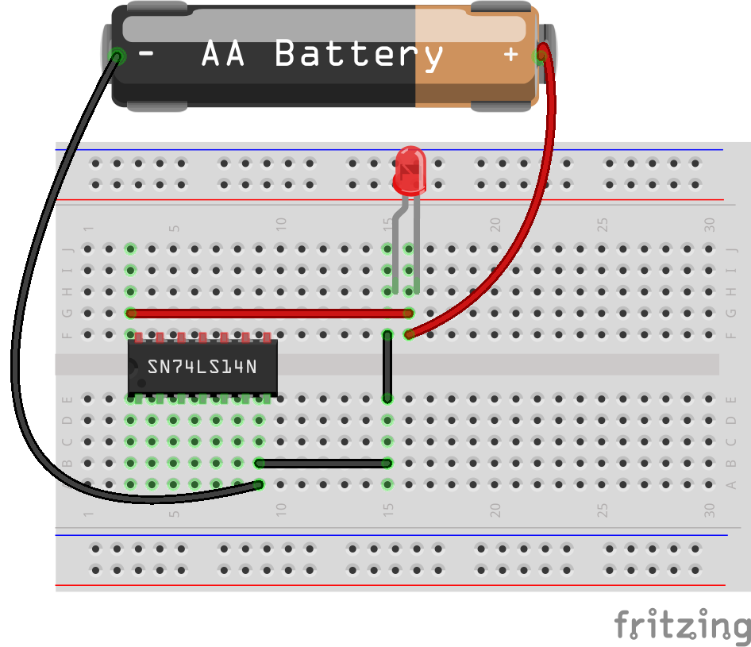

# 組み合わせ回路

組み合わせ回路は、デジタル回路の一種であり、入力信号の組み合わせだけで出力が決まるという特徴を持っている。言い換えると、過去の入力や記憶状態に影響されず、現在の入力のみで出力が決定される回路のこと。

組み合わせ回路は、ANDゲート、ORゲート、NOTゲート、XORゲートなどの基本的な論理ゲートを組み合わせることで構成される。これらの論理ゲートを組み合わせることで、様々な論理関数を表現することができる。

## XORゲートの真理値表

EXOR, EOR ともいう。Exclusive OR (排他的論理和) の頭文字を取ったもの。

| 入力A | 入力B | 出力 |
|---|---|---|
| 0 | 0 | 0 |
| 0 | 1 | 1 |
| 1 | 0 | 1 |
| 1 | 1 | 0 |

**説明**

* 入力Aと入力Bが**異なる**場合、出力は **1** になる。
* 入力Aと入力Bが**同じ**場合、出力は **0** になる。

**例**

* 入力Aが0、入力Bが1の場合、出力は1になります。
* 入力Aが1、入力Bが0の場合、出力は1になります。
* 入力Aが0、入力Bが0の場合、出力は0になります。
* 入力Aが1、入力Bが1の場合、出力は0になります。

XORゲートは、2つの入力信号が**互いに排他的である**かどうかを判定するために使用される。例えば、2つのスイッチのどちらか一方だけがオンになっているかどうかを判定したり、2つのデータが異なるかどうかを判定したりするために使用することができる。

**補足**

* XORゲートは、排他的論理和ゲートとも呼ばれます。
* XORゲートは、NOTゲート、ANDゲート、ORゲートを組み合わせて構成することができる。

**課題 (難易度高し)**

EXOR ゲートを NAND と NOT を使って構成せよ。  
**ヒント：NOT は 2 つ。NAD は 3 つ使う。**

## 多入力 NAND, NOR

3 入力以上の論理回路は 2 入力回路を組み合わせれば、構成できる。  
4 入力 NAND も 2 入力の組み合わせ。

  

# 半加算回路 -Half adder-

半加算回路は、2つの 1 ビットの二進数を入力とし、その和と桁上がり信号を出力するデジタル回路である。言い換えると、**2 つの 1 桁の二進数を足した結果と、その結果が 2 桁になるかどうか** を判断する回路である。

半加算回路は、**ANDゲート**、**ORゲート**、**NOTゲート** などの基本的な論理ゲートを組み合わせることで構成される。

半加算回路の真理値表は以下の通り。

| 入力A | 入力B | 桁上がりCo | 和 S |
|---|---|---|---|
| 0 | 0 |  |  |
| 0 | 1 |  |  |
| 1 | 0 |  |  |
| 1 | 1 |  |  |

Co は Carry Out ((上位への)桁上り), S は Sum (和) を表す

* 半加算回路は、2 つの1ビットの二進数しか加算できない。
* 半加算回路は、下位桁からの繰り上がりを考慮しない。上位桁への繰り上がりを考慮するには、全加算回路を使用する必要がある。

**■ 質問：Co はなに回路と同じか**
**■ 質問：S はなに回路と同じか**

## 半加算器の構成

- XOR と AND があれば半加算器は作れる
  S = XOR(A, B)  
  Co = AND(A, B)  
 

  

# 全加算器 -Full adder-

11 + 11 を考えてみる。

- 全加算器は下のケタからの繰り上がり Ci (Carry in) を考慮する
- 半加算器を 2 段組み合わせればできそうだ

全加算器は、2つの1ビットの二進数と1ビットの繰り上がり信号を入力とし、その和と上位桁への繰り上がり信号を出力するデジタル回路である。言い換えると、**2つの1桁の二進数と1ビットの繰り上がり信号を足した結果と、その結果が2桁になるかどうか**を判断する回路である。

全加算器は、**半加算器**2つと**ORゲート**1つを組み合わせて構成される。

- S = (A+B の下一桁) + Ci
- Co = (A+B の繰り上がり) or (S'+Ci の繰り上がり)

  

全加算器の真理値表は以下の通り。
 
| 入力A | 入力B | 下位からの繰り上がり Ci | 和 S | 上位桁への繰り上がり Co |
|---|---|---|---|---|
| 0 | 0 | 0 |  |  |
| 0 | 0 | 1 |  |  |
| 0 | 1 | 0 |  |  |
| 0 | 1 | 1 |  |  |
| 1 | 0 | 0 |  |  |
| 1 | 0 | 1 |  |  |
| 1 | 1 | 0 |  |  |
| 1 | 1 | 1 |  |  |

全加算器は、コンピュータやデジタル機器の様々な部分で使用されている。例えば、算術論理装置 (ALU) や加算器など。

# 任意の論理回路の構成法

全加算器を例に、任意の論理回路を作る方法を説明する。

**■ まず入力をチェックする**
1. 仮にここでは M<X> とする
2. M<X> が 1 になる条件を考える

| M | A | B | Ci | S | Co |
|--|---|---|---|---|---|
M0 | 0 | 0 | 0 |  |  |
M1 | 0 | 0 | 1 |  |  |
M2| 0 | 1 | 0 |  |  |
M3 | 0 | 1 | 1 |  |  |
M4| 1 | 0 | 0 |  |  |
M5 | 1 | 0 | 1 |  |  |
M6| 1 | 1 | 0 |  |  |
M7| 1 | 1 | 1 |  |  |

## 質問

- M7 が選択されるのはどういうときか。
- M0 が選択されるのはどういうときか。
- その他 M1 ~ M6 が選択されるのはどういうときか。
  
## (0,0,0) の回路

- あらかじめ A と ~A, B と ~B, Ci と ~Ci を用意しておく
- M1 ~ M7 までを作図せよ

  

## 後半 出力をつくる

- Co が 1 になるのはどういうときか？
  - M3, M5, M6, M7 のどれかが 1 のとき
- S が1 になるのはどういうときか？
- 作図せよ
  

  

このような構成法を **AND-OR 回路**という。

## 課題

XOR 回路を AND-OR 回路で構成せよ
