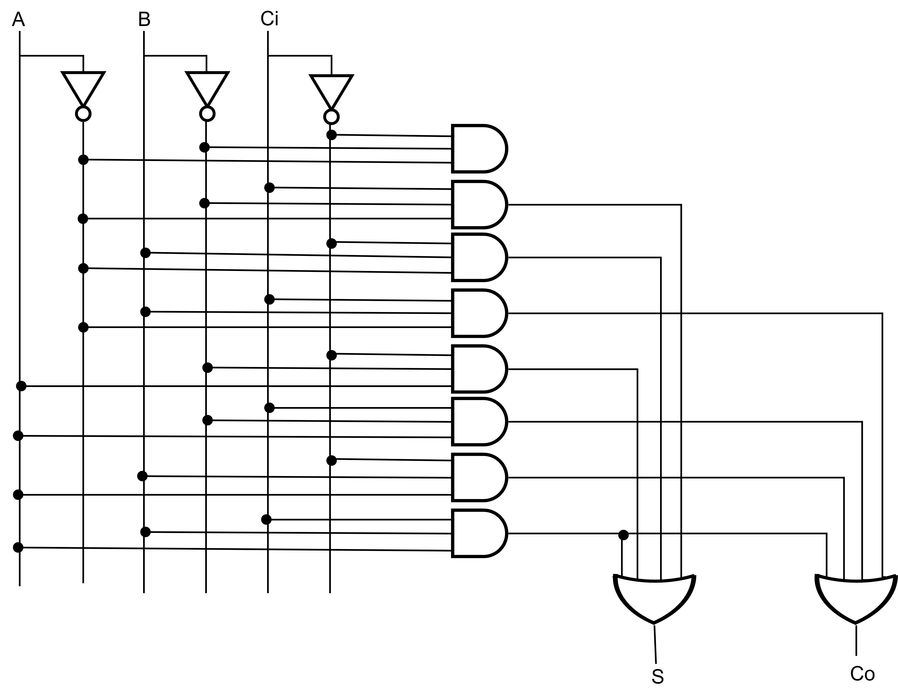

# ド・モルガンの法則

どんな回路でも AND と OR と NOT を組み合わせれば作れるという説明をした。
しかし、半導体のスイッチ (FET) を使った場合には、NAND や NOR のほうが作りやすいということもある。
すべての AND-OR 回路が NAND-NAND 回路でつくれるということを説明する。

  
   
  全加算器の AND-OR 回路

## ド・モルガンの法則

- OR(A, B) = NAND(NOT(A), NOT(B))  
    A + B = ~(~A・~B) = NAND(~A, ~B)

- AND(A, B) = NOR(NOT(A), NOT(B))  
    A・B = ~(~A + ~B) = NOR(~A, ~B)

## NAND-NAND 回路

AND-OR 回路はド・モルガンの法則を使えば NAND に置き換えることができる

全加算器を例に取ると、入力をチェックする M<X> の部分は AND で構成されているので、そのまま NAND を利用できる。

~M0 = NAND(~A, ~B, ~Ci)  
~M1 = NAND(~A, ~B, Ci)  
~M2 = NAND(~A, B, ~Ci)  
~M3 = NAND(~A, B, Ci)  
~M4 = NAND(A, ~B, ~Ci)  
~M5 = NAND(A, ~B, Ci)  
~M6 = NAND(A, B, ~Ci)  
~M7 = NAND(A, B, Ci)  

つぎに出力の OR は NAND(NOT) の組み合わせになるので、

Co = NAND(~M3, ~M5, ~M6, ~M7)  
S = NAND(~M1, ~M2, ~M4, ~M7)  

である。このようにすればいかなる出力も NOT, NAND を組み合わせればよいことが理解できると思う。つまり NOT と NAND だけあれば、如何なる論理回路も構成できてしまうのである。NOT は 1 入力の NAND とみなすこともできるので、結局のところ「どんな論理もNAND だけで構成できる」と表現することが多い。これを NAND-NAND 回路という。

同様のアプローチで NOR 回路のみで構成する NOR-NOR 回路という方法もある。興味のある人は調べてみてほしい。

# 全加算器（別解）

全加算器は、半加算器 2 つと OR 回路があれば作ることができる。

- S = (A+B の下一桁) + Ci
- Co = (A+B の繰り上がり) または (A+B+Ci) の繰り上がり

  
   
  半加算器を 2 つ使った半加算器

## 課題

1. 半加算器を XOR と AND でつくろう。

  
   

2. 1. の半加算器と OR 回路でつくろう。

  
   

3. 2. を３つ組み合わせて 3 ビットの加算回路をつくろう。

  
   

