# 順序回路 (シーケンス回路)

**ここで使っているシーケンスは、時間の流れ、時系列という意味で、シーケンス制御のシーケンスとはすこし意味が違う。シーケンス制御のシーケンスは「順番」の意味。**

さて、これまでで**組み合わせ回路**について勉強した。
NOT, AND, OR があればどんな回路でも作れる、ということを理解してもらえたと思う。
ただし、条件がひとつあった。それは「必ず入力で出力が決定する」ということである。

言い換えれば、**「計算（演算）」はするけど「記憶」はしない** 回路だった。

 
 

  
   

 

しかし、みなさんのスマートフォンを見てもわかるとおり、現在のコンピュータは、「以前の状態」を記憶していて、それによって動作が変わる部分もある。たとえば、TikTok のおすすめは、あなたの閲覧の履歴から好みの映像を流すようになっている。

これは入力だけでなく過去の履歴（記憶）が利用されている。

単純化すると下の図のように一つ前の状態によって動作が変わる、ということである。これを順序回路 (シーケンス回路) という。

「前の状態がこうだったから、今の値はこうしよう」

というように記憶が利用されている。

 
 

  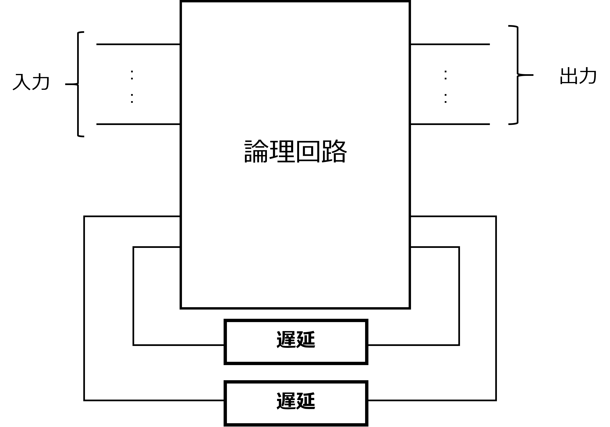
   
  一つ前の出力が入力に回ってきて、次の出力に反映される

論理回路の状態を、**内部状態 (internal state)** という。現在の内部状態は、１回前の内部状態と現在の入力で決定する。

切符の自動販売機も、スマホも、高性能な大型コンピュータも、すべてこうしたシーケンス回路（順序回路）である。

# ラッチ

では一番簡単なメモリ（ラッチ）を紹介する。

- もし NOT2 の出力が 0 なら NOT1 の出力は 1
- もし NOT2 の出力が 1 なら NOT1 の出力は 0

どちらかの値を記憶している。

**最初の状態は未知、どちらになるかは予想できない** が、とにかく 1bit 記憶できる。

 
 

  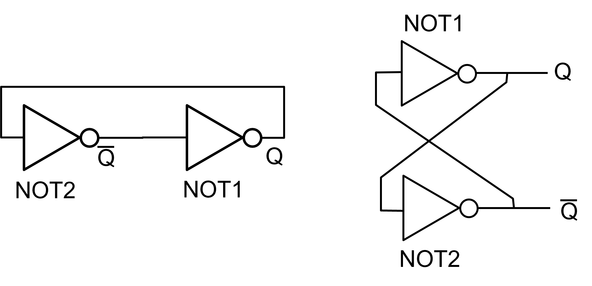
   

**■ メタステーブル**   
電子回路において、本来規定されている時間よりも入力信号が変化した場合に、出力信号が安定しない状態。両方の NOT の出力が 0 と 1 の中間地点にある状態 (エラー状態)

⇒ こういう状態になることもありうる。こうなると「発振」(0 と 1 を行き来する) することも。

## OR 回路を使ったラッチ

*資料 pp.93* には OR 回路を使ったラッチが紹介されている。
## 回路シミュレータ

これ以降、回路シミュレータを使用して、動きを確認することにする。

https://www.falstad.com/circuit/circuitjs.html

回路シミュレータの操作方法の確認もあわせて、**OR回路を使ったラッチ** のシミュレーションをしてみよう。  
■ 演習 5-1-1  
「ヒント」は気にしなくてもよくなっているようだ  
テキストを参考に LED もつけてみよう  
■ 演習 5-1-2  
■ 演習 5-1-3  

## RS ラッチ

- NOR 回路の「タスキがけ」構造
- NOT のたすき掛けと似ているが、R と S を用いて記憶状態をコントールできる
- Q を**セット**したり**リセット**したりできるから SR ラッチ
- ラッチ (latch) は留め具を表す英単語
- テキストでは RS-FF と紹介されているが、RS ラッチが正しいので注意

※ NOR は入力 (0 0) のときだけ 1、それ以外は 1

 
 

  
   

### R=1, S=0

*テキスト pp.100*

- NOR1 の片方 R=1 なので、Q=0 になる, S=0 なので、~Q = 1

 
 

  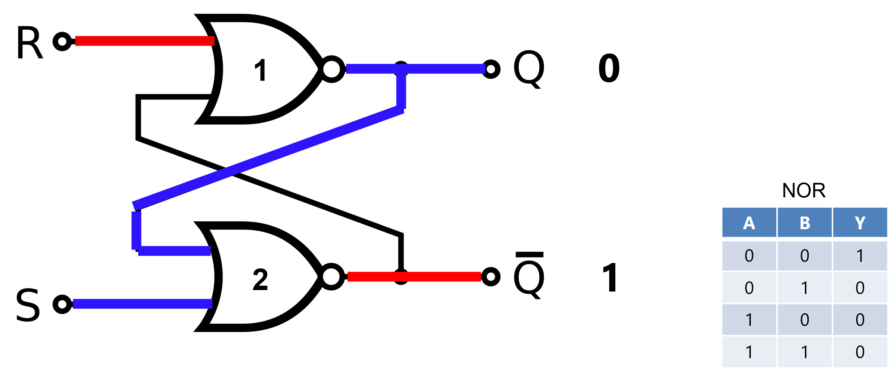
   

### R=0, S=1

*テキスト pp.99*

- NOR1 には 0 と ~Q が入力されるが、Q はその時点ではわからない
- NOR2 には 1 が入力され、~Q は 0 になる
- NOR1  の入力が 00 となり、Q は 1 になる

 
 

  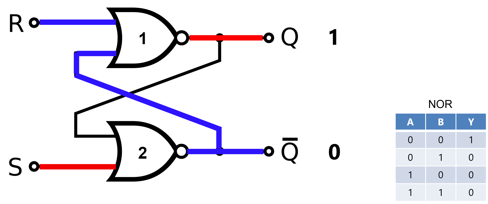
   

### R=1, S=1

*テキスト pp.101*

- NOR1 と NOR2 に少なくともひとつ１の入力がある → Q, ~Q は0
 
 

  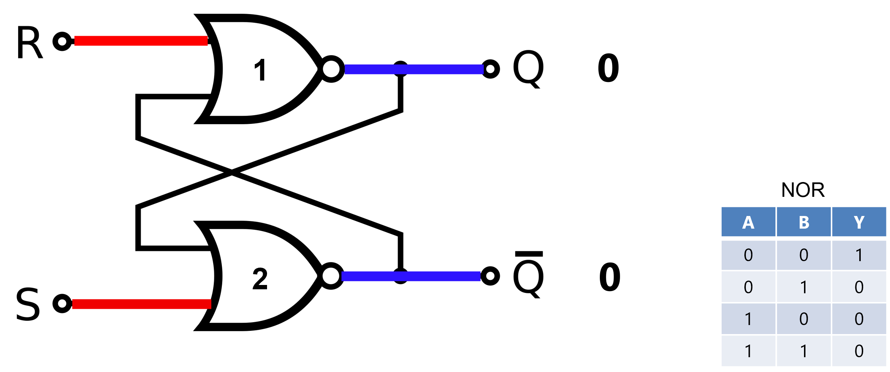
   

### R=0, S=0

*テキスト pp.99, 100*

- NOR1 には 0 と ~Q が入力、~Q はわからない
- NOR2 には 0 と Q が入力、Q はわからない

**■ ところが前の Q, ~Q が決まっていれば決まる：**
- **前の Q が 1 のとき、前の状態を維持する**
- **前の Q が 0 のとき、前の状態を維持する**

 
 

  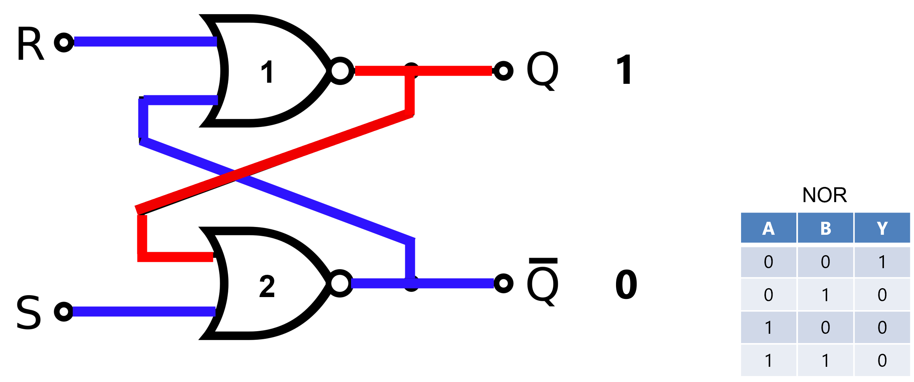
   

## RS ラッチのまとめ

1. R と S が 0 ならば、前の値を保持している
2. ~Q には Q の否定が保持されている  
  → 1 bit 記憶している
3. S は「セット」、R は「リセット」
4. S=1, R=1 とすると、セットとリセットを同時にすることになり、意味をなさなくなってしまう（おかしな動作になる）⇒ 禁止入力とする

 
 

  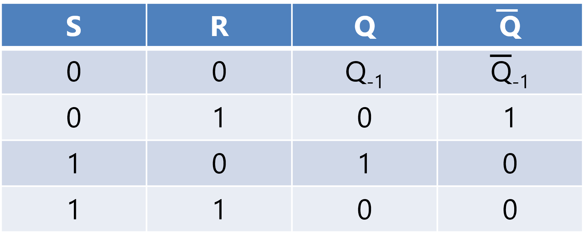
   

 
 

  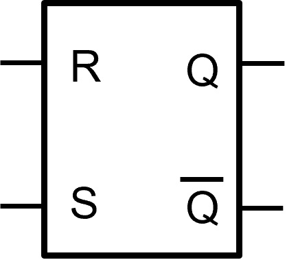 
  <strong>RS ラッチの回路記号</strong>
   

やってみよう  
■ 回路シミュレータをつかって RS ラッチを作成し、動作を確認してみよう。
■ **演習 5-2-1**  
■ **演習 5-2-2**  
■ **演習 5-2-3**  

## D ラッチ

RS ラッチは S と R 両方を ON にすると誤動作を引き起こす (Q と ~Q が 0 になってしまう)。この問題を解消したのが **D ラッチ** である。

入力の意味と呼び方を以下のように変更する：

- CLK  
  クロックの略で、「いつ状態を変えるのか」をコントロールする
- D  
  データの略で「記憶させたいデータ」を入力する

 
 

  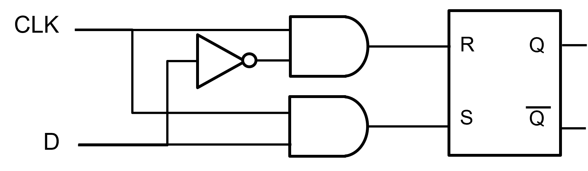 
  <strong>D ラッチ</strong> 

RS ラッチの手前に AND を置き、CLK が ON かつ D が ON のときに S (セット) が動くようにしている 
  
■ **演習**

回路シミュレータをつかって D ラッチを作成し、動作を確認してみよう。

## D フリップフロップ (D-FF)

*テキスト pp.115*

ついに主役の登場である。この **D フリップフロップ (D-FF)** こそ、現在のコンピュータのメモリそのものである。D ラッチは CLK=1 の間、いつでも D の値が取り込まれる。

これでは具合が悪いときがある (たとえば計算途中で信号が変化したら、それが記憶されてしまう)。

ある特定の瞬間だけ (具体的には CLK の立ち上がり)、値が取り込まれるほうが便利な時がある (専門用語で「クロックの立ち上がり」という)。

これを実現したのが、D フリップフロップ (D-FF) である。

  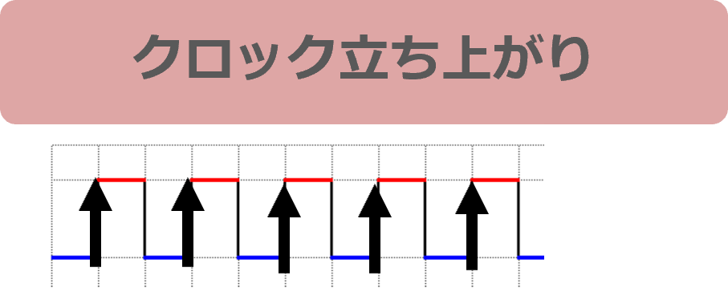
   
  この↑の瞬間の D を取り込む

 
 

  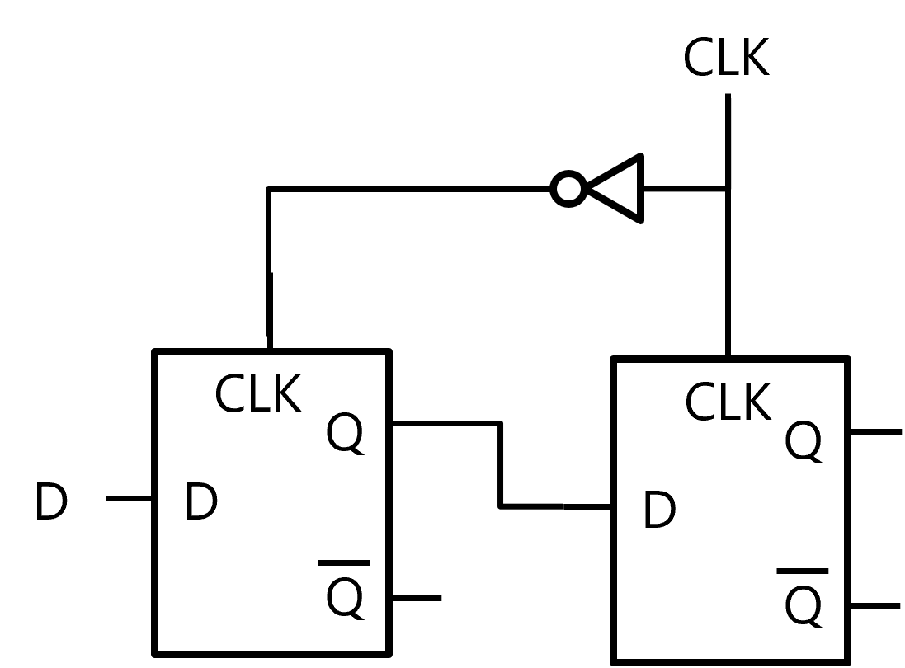
   
  <strong> これが D-FF だ！</strong>

CLK が 0 のときに前段の D ラッチに値がとりこまれ、CLK が 1 になったときに後段の D ラッチに値がとりこまれる(と同時に前段の D ラッチは値の取り込みをやめる)。

■ **演習**
回路シミュレータをつかって D-FF を作成し、動作を確認してみよう。  
■ 演習 5-5-1  

